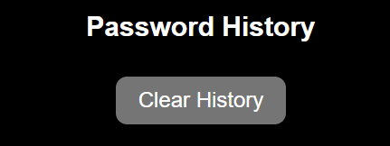

# CryptoKeyGen
CryptoKeyGen is a web-based application designed to generate strong and secure passwords based on user preferences. This README provides an overview of the application's functionality, features, and how to use it effectively.

CryptoKeyGen is a user-friendly password generator web application designed to operate seamlessly across various screen sizes, from small mobile devices to larger desktop screens. Whether you're accessing it on your smartphone, tablet, or computer, CryptoKeyGen ensures a consistent and intuitive experience for generating strong and secure passwords.

## Features
* Responsive Design: Adapts to different screen sizes to provide optimal usability.
  
* Password Generation: Allows users to generate passwords of varying lengths (between 5 and 32 characters) with options to include special characters, capital letters, and numbers.

* Password History: Maintains a history of generated passwords during the session, which persists across page reloads using localStorage.
  
* User-Friendly Interface: Clean and responsive design with easy-to-understand form inputs and clear password output.

* Clipboard Copy:  Easily copy generated passwords to your clipboard for immediate use. 

## Getting started
To use CryptoKeyGen, follow these steps:

#### 1-Accessing the Application:
* Clone the repository or download the source code to your local machine.
  
* Open the index.html file in your web browser.
  
#### 2- Generating Passwords:
  * Enter the desired number of characters for the password (between 5 and 32).
 
  * Check the boxes to include special characters, capital letters, or numbers based on your preferences.
 
  * Click on the "Generate Password" button to create a new password.
  
  * The generated password will be displayed in the output box.

 #### 3- Password History:
 * Below the password generator form, you'll find a section labeled "Password History."
  
 * This section displays a list of passwords generated during the current session.
 
 * Click the "Clear History" button to remove all passwords from the history.

## Dependencies
* Font Awesome: Provides icons for user interface elements.

* LocalStorage: Used to store and retrieve generated passwords for the session.

## Compatibility
* CryptoKeyGen is compatible with modern web browsers that support HTML5, CSS3, and JavaScript.

## Contributing
* Contributions to CryptoKeyGen are welcome! If you have suggestions for improvements, bug reports, or feature requests, please submit them via GitHub issues.

## Acknowledgments
* Font Awesome (https://fontawesome.com/) for providing icons used in the user interface.
* My Mentor Spencer Bariball who guided me during the development of this project.
* OpenAI for providing some resources, such as color ideas, code organisation and grammar correction.
* My friends and family, who gave me ideas of additional features for my project.
* The tutorial that gave me inspiration for the project (https://youtu.be/iKo9pDKKHnc?si=flbo-eDxdxyOA0un)
* I also took some inspiration codes from W3schools(https://www.w3schools.com/)
* I took inspiration of my README file from (https://github.com/SophieTiger/to-do-list.git)