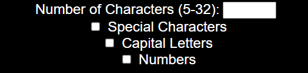
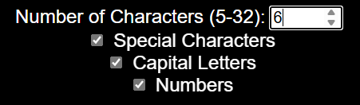
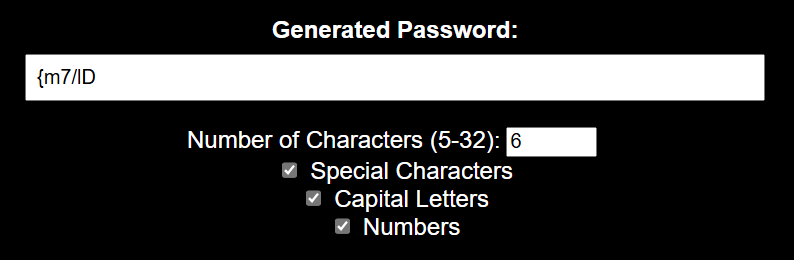
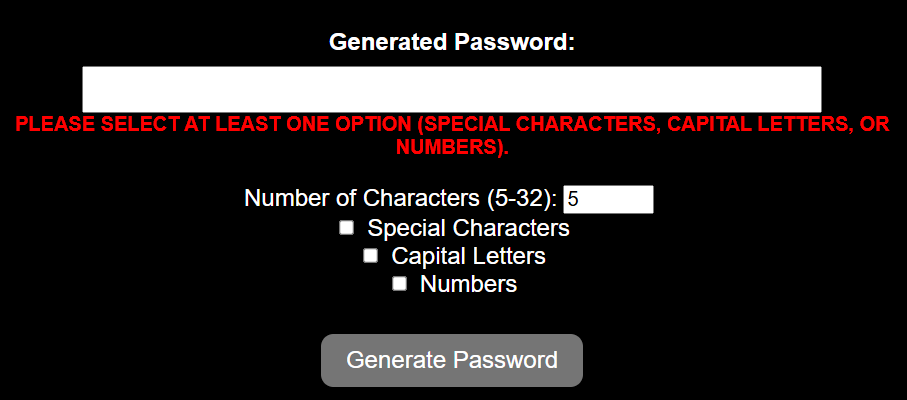
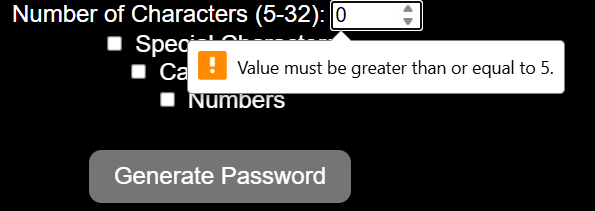
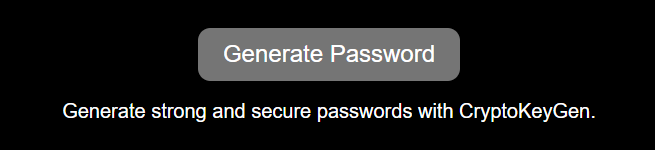
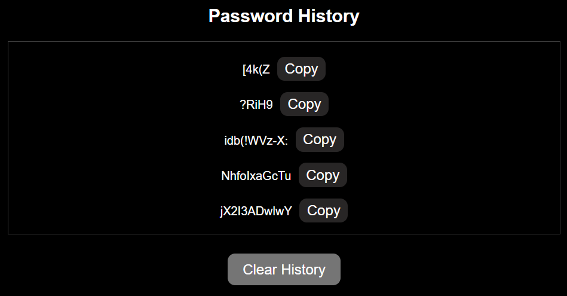
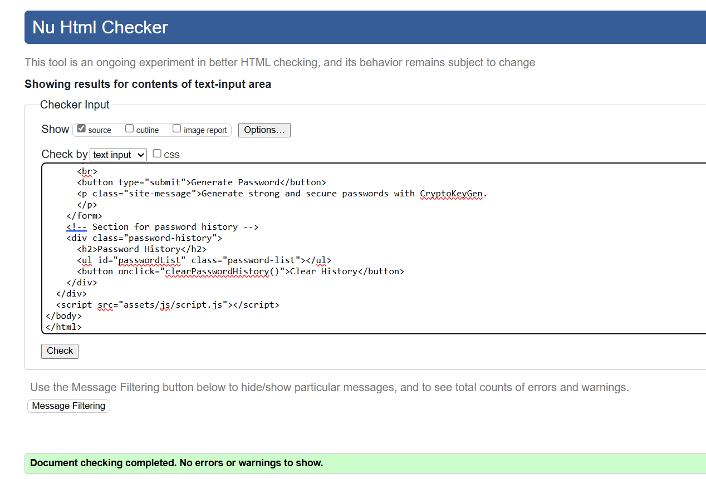
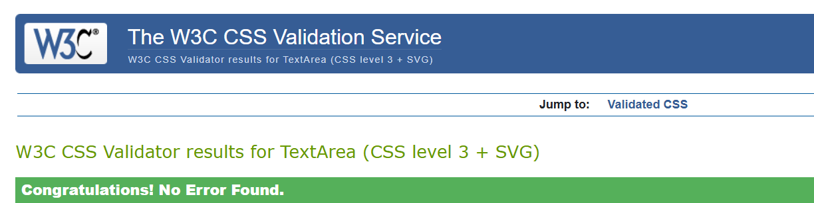

# CryptoKeyGen
CryptoKeyGen is a web-based application designed to generate strong and secure passwords based on user preferences. This README provides an overview of the application's functionality, features, and how to use it effectively.

CryptoKeyGen is a user-friendly password generator web application designed to operate seamlessly across various screen sizes, from small mobile devices to larger desktop screens. Whether you're accessing it on your smartphone, tablet, or computer, CryptoKeyGen ensures a consistent and intuitive experience for generating strong and secure passwords.

# Getting started
To use CryptoKeyGen, follow these steps:
## Main-heading:
* It contains the name of the website

## Input and Output sections:
* It contains a section that displays the generated password according to the user preferences.

* This section allows the users to customize how many characters they want for the generator to create a password, only values between 5 and 32 are accepted.
* Also, which elements to include in the generated password.

 * There are check-boxes after each customizable character in which the user can select as wanted.
  

* The generated password section displays the final strong generated password based on the the user customisations.
  

* If the users do not select any of the types of characters they want, a warning message will be displayed. In addition, if the number of characters chosen is not in between the acceptable range, another message will be displayed.

* The users can then click the Generate Password button which will display the password in the Generated Password box.
* A short message that says 'Generate strong and secure passwords with CryptoGen' is shown to inform the users that they can safely use this program whenever they need to.
  

* The users can generated as many password they want, and the generated passwords will be displayed in a Password History section.
* A copy text button is displayed beside the generated password, for each password in the history section. This allows users to copy the password/s they want to use them later.

* There is a clear History button that allows users to clear the password history.

## Features
* Responsive Design: Adapts to different screen sizes to provide optimal usability.
  
* Password Generation: Allows users to generate passwords of varying lengths (between 5 and 32 characters) with options to include special characters, capital letters, and numbers.

* Password History: Maintains a history of generated passwords during the session, which persists across page reloads using localStorage.
  
* User-Friendly Interface: Clean and responsive design with easy-to-understand form inputs and clear password output.

* Clipboard Copy:  Easily copy generated passwords to your clipboard for immediate use. 

### 1-Accessing the Application:
  * Clone the repository or download the source code to your local machine.
  
  * Open the index.html file in your web browser.
  
### 2- Generating Passwords:
* Enter the desired number of characters for the password (between 5 and 32).
 
  * Check the boxes to include special characters, capital letters, or numbers based on your preferences.
 
  * Click on the "Generate Password" button to create a new password.
  
  * The generated password will be displayed in the output box.

### 3- Password History:
 * Below the password generator form, you'll find a section labeled "Password History."
  
 * This section displays a list of passwords generated during the current session.
 
 * Click the "Clear History" button to remove all passwords from the history.

## Dependencies
* LocalStorage: Used to store and retrieve generated passwords for the session.

## Compatibility
* CryptoKeyGen is compatible with modern web browsers that support HTML5, CSS3, and JavaScript.

## Contributing
* Contributions to CryptoKeyGen are welcome! If you have suggestions for improvements, bug reports, or feature requests, please submit them via GitHub issues.

## Future features to implement: 
### 1-Password Strength Indicator:
* Add a visual indicator (like a colored bar or text) that shows the strength of the generated password based on its complexity (e.g., weak, medium, strong).
### 2-Password Sharing Option:
* Allow users to securely share generated passwords via email or messaging apps directly from the application.
  
### 3-User Feedback Mechanism:
* Include a feedback form or survey to gather user input for further improvements.

# Testing 
* Accessibility
  * I ran a lighthouse test and 
  
  
  Bug : 'The value of the for attribute of the label element must be the ID of a non-hidden form control.'

  
## Acknowledgments
* Font Awesome (https://fontawesome.com/) for providing icons used in the user interface.
* My Mentor Spencer Bariball who guided me during the development of this project.
* OpenAI for providing some resources, such as color ideas, code organisation and grammar correction.
* My friends and family, who gave me ideas of additional features for my project.
* The tutorial that gave me inspiration for the project (https://youtu.be/iKo9pDKKHnc?si=flbo-eDxdxyOA0un)
* I also took some inspiration codes from W3schools(https://www.w3schools.com/)
* I took inspiration of my README file from (https://github.com/SophieTiger/to-do-list.git)