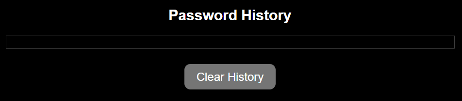

# CryptoKeyGen
CryptoKeyGen is a web-based application designed to generate strong and secure passwords based on user preferences. This README provides an overview of the application's functionality, features, and how to use it effectively.

CryptoKeyGen is a user-friendly password generator web application designed to operate seamlessly across various screen sizes, from small mobile devices to larger desktop screens. Whether you're accessing it on your smartphone, tablet, or computer, CryptoKeyGen ensures a consistent and intuitive experience for generating strong and secure passwords.

# Getting started
## Main-heading:
* It contains the name of the website.

## Input and Output sections:
* It contains a section that displays the final generated password according to the user preferences.

* There is a section that allows the users to customize how many characters they want for the generator to create a password, only values between 5 and 32 are accepted.
* Also, which elements to include in the generated password.

 * There are check-boxes after each customizable character in which the user can select as wanted.
  

* The generated password section displays the final strong generated password based on the user customisations.
  

* If the users do not select any type of characters, a warning message will be displayed. In addition, if the number of characters chosen is not in between the acceptable range of 5 to 32, another message will be displayed.

* The users can then click the Generate Password button which will display the password in the Generated Password box.
* A short message below the button that says 'Generate strong and secure passwords with CryptoGen' is shown to inform the users that they can safely use this program whenever they need to.
  

* The users can generated as many password as they want, and the generated passwords will be displayed in a Password History section.
* A copy text button is displayed beside the generated password, for each password in the history section. The copied password is saved in a Local Storage. This allows users to copy the password/s they want and paste somewhere to use later.

* There is a clear History button that allows users to clear the password history.

## Features
* Responsive Design: Adapts to different screen sizes to provide optimal usability.
  
* Password Generation: Allows users to generate passwords of varying lengths (between 5 and 32 characters) with options to include special characters, capital letters, and numbers.

* Password History: Maintains a history of generated passwords during the session, which persists across page reloads using localStorage.
  
* User-Friendly Interface: Clean and responsive design with easy-to-understand form inputs and clear password output.

* Clipboard Copy:  Easily copy generated passwords to your clipboard for immediate use. 

# How to use CryptoKeyGen
## 1-Accessing the Application:
  * Clone the repository or download the source code to your local machine.
  
  * Open the index.html file in your web browser.
  
## 2- Generating Passwords:
* Enter the desired number of characters for the password (between 5 and 32).
 
  * Check the boxes to include special characters, capital letters, or numbers based on your preferences.
 
  * Click on the "Generate Password" button to create a new password.
  
  * The generated password will be displayed in the output box.

## 3- Password History:
 * Below the password generator form, you'll find a section labeled "Password History."
  
 * This section displays a list of passwords generated during the current session.
 
 * Click the "Clear History" button to remove all passwords from the history.

## Dependencies
* LocalStorage: Used to store and retrieve generated passwords for the session.

## Compatibility
* CryptoKeyGen is compatible with modern web browsers that support HTML5, CSS3, and JavaScript.

## Contributing
* Contributions to CryptoKeyGen are welcome! If you have suggestions for improvements, bug reports, or feature requests, please submit them via GitHub issues.

## Future features to implement
### 1-Password Strength Indicator:
* Add a visual indicator (like a colored bar or text) that shows the strength of the generated password based on its complexity (e.g., weak, medium, strong).
### 2-Password Sharing Option:
* Allow users to securely share generated passwords via email or messaging apps directly from the application.
  
### 3-User Feedback Mechanism:
* Include a feedback form or survey to gather user input for further improvements.

## Testing 
* Accessibility
  * I ran a lighthouse test for mobile and desktop and all the scores were above 90.
  
  

  * I tested and confirmed that the web page works in different browsers: Chrome, Edge ,Safari and Firefox.
  
 

* HTML
  * I ran a w3School HTML validator (https://validator.w3.org/nu/#textarea), and 1 error was found in the ID of the form so I fixed it.

  
 
* CSS
  * I ran a w3School CSS validator (https://jigsaw.w3.org/css-validator/), and no errors were found. 

  

* Javascript:
  * I ran a Javascript validator (https://jshint.com/), and 31 warnings were found, but unfortunately they are about Eversions and Mozilla JS extensions, which I cannot do anything about.

  
* Accessibility test:
  * I did an accessibility tool test and no errors were detected.
  
  

* Features Testing
  * I tested selecting only special characters and generate a password.
  * I tested using only capital letters and generate a password.
  * I tested using only numbers and generate a password.
  * I tested selecting all three 'special characters, capital letters and numbers'
  * I tested copying all the generated passwords in the history section and pasting them outside the website.
  
## Bugs
* Bugs in the lighthouse testing:
  * Performance was showing  a score of 99. I went through the requirements and it said that there was a console error . I fixed that and it went up to 100.

* Bugs when I ran my code through w3School HTML validator : 
    * Addressed an error related to the `for` attribute in a label element, ensuring it correctly references the ID of a visible form control.
  
* I was having problems with deployment of my web page to github pages. But after sharing it with my Mentor I realised I just had to redeploy the page.
  
* I also found difficulties into adding a Favicon to the copy button. So I decided to add a text of 'Copy' and it worked better.

## Unfixed bugs
* No unfixed bugs.

## Deployment
### Version Control
* The site was created using Visual Studio Code editor and pushed to Github to the remote repository 'CryptoKeyGen'.

* Git commands were used throughout the development to push the code to the remote repository. The following git commands were used:
  
  * git add . - to add the files to the staging area before being committed.
  * git commit -m "commit message" - to commit changes to the local repository queue that are ready for the final step.
  * git push - to push all committed code to the remote repository on Github.
### Deployment to Github pages

* This site was deployed to Github pages as follows:
  
  * In the Github repository, navigate to Settings tab.
    * From the source section drop-down menu, I selected to Deploy from a branch. From the Branch I chose the main branch and Saved.
  * I was provided with a link to the website.
  The live link: (https://hbica05.github.io/CryptoKeyGen/) 

### Cloning of the Repository Code locally

* Go to the Github repository that you want to clone.
* Click on the Code button located above all the project files.
* Click on HTTPS and copy the repository link.
* Open the IDE of your choice and and paste the copied git url into the IDE terminal.
* The project is now created as a local clone.

## Acknowledgments

* A special thanks to my Mentor Spencer Barriball who guided and supported me during the development of this project.
  
* Font Awesome (https://fontawesome.com/) provided the icon used in the web title.

* OpenAI provided some resources, such as color ideas, code organisation and grammar correction.

* My friends and family, who gave me ideas of additional features for my project.

* The tutorial that gave me inspiration for the project (https://youtu.be/iKo9pDKKHnc?si=flbo-eDxdxyOA0un).

* Some inspiration codes were taken from W3schools (https://www.w3schools.com/).

* A big inspiration for my README file was from (https://github.com/SophieTiger/to-do-list.git).

* Screenshots of responsive version taken using (https://www.awesomescreenshot.com/).